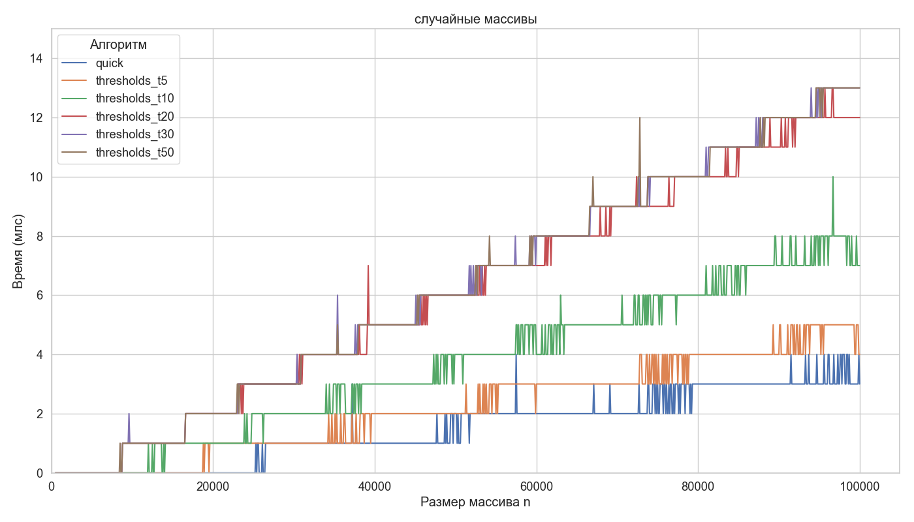
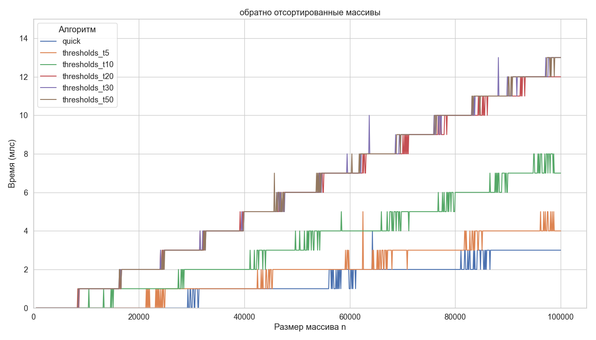
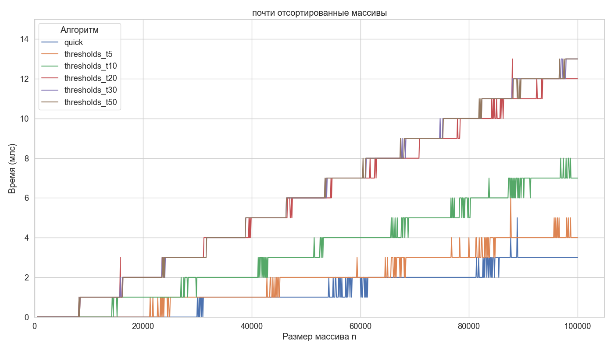

# aads_set3

## Графики

## Анализ
По результатам экспериментов для всех трёх типов входных данных алгоритм Quick Sort демонстрирует заметное преимущество по времени выполнения по сравнению с Merge Sort. Кроме того, Quick Sort показывает существенно меньшее количество выбросов на графиках. Это связано с тем, что при случайном выборе опорного элемента алгоритм значительно слабее зависит от входных данных и чаще работает близко к своему среднему случаю

Дополнительно установлено, что оптимальное значение порога переключения threshold для гибридных версий алгоритма составляет менее 10